<div align="center">

#  Roomly

### PG finder, digital room key & PG organizer, built for private, single-occupancy rooms

*Find a verified PG, see exactly where it is on the map, read honest ratings, and get a digital key the day you move in.*

### 🌐 [Live demo → pg-management-system-flax.vercel.app](https://pg-management-system-flax.vercel.app)

[](https://pg-management-system-flax.vercel.app)


</div>

---

## ✨ Overview

**Roomly** is a full-stack platform that connects **residents** (students and working professionals) with **PG owners**. Every room on Roomly is for **one person only, no sharing**. Residents discover and book a PG, owners list and manage theirs, and an AI assistant answers questions along the way.

The same React codebase runs as a **website** and as an **Android app** (via Capacitor).

👉 **Try it now:** [pg-management-system-flax.vercel.app](https://pg-management-system-flax.vercel.app)

---

## 📸 Screenshots

### 💻 Desktop

<div align="center">

| Home | Browse PGs |
|:---:|:---:|
| 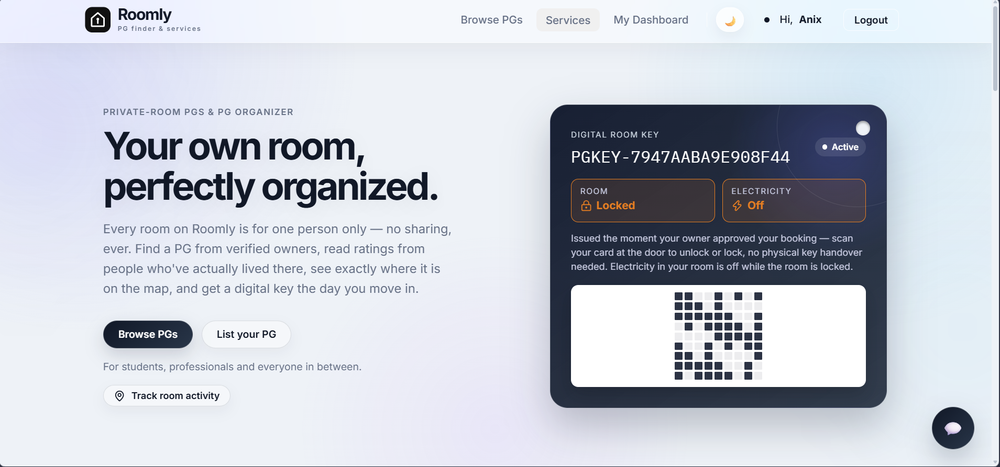 | 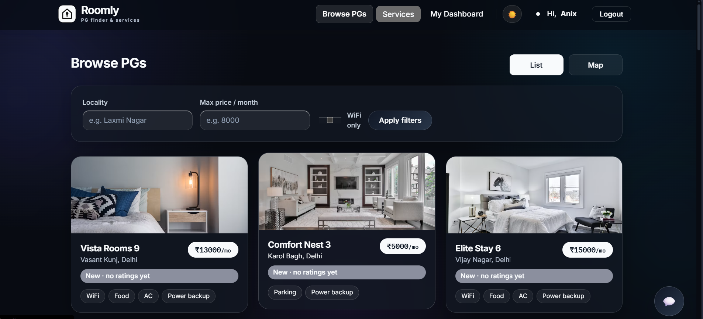 |
| **PG details** | **Dark mode** |
| 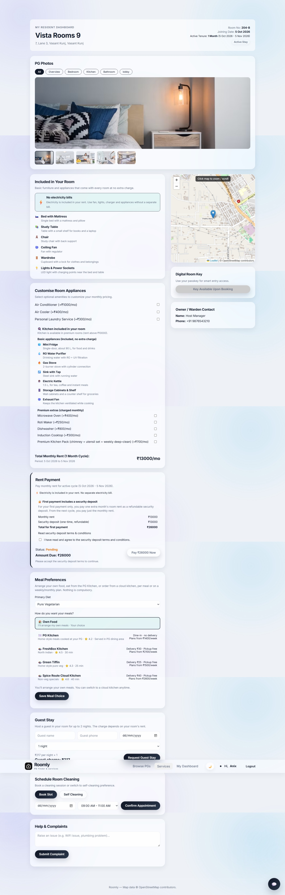 | 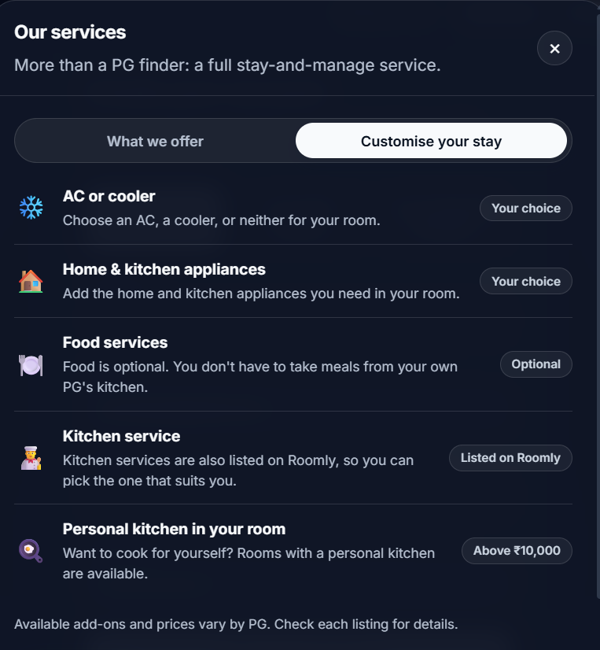 |
| **AI chatbot** | **Login** |
| 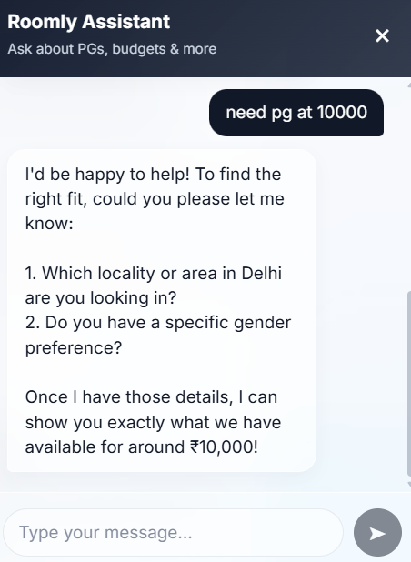 | 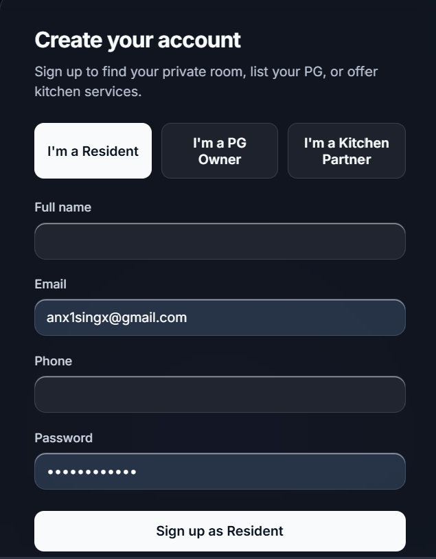 |

</div>

### 📱 Mobile app

<div align="center">

| Home | Browse PGs | PG details | Mobile menu | Dark mode |
|:---:|:---:|:---:|:---:|:---:|
| 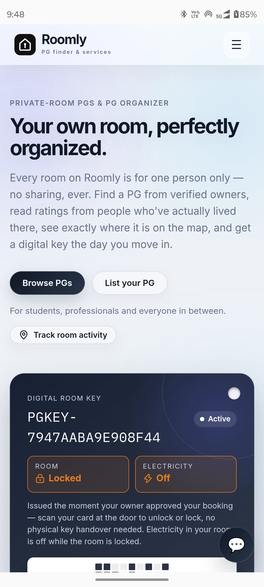 | 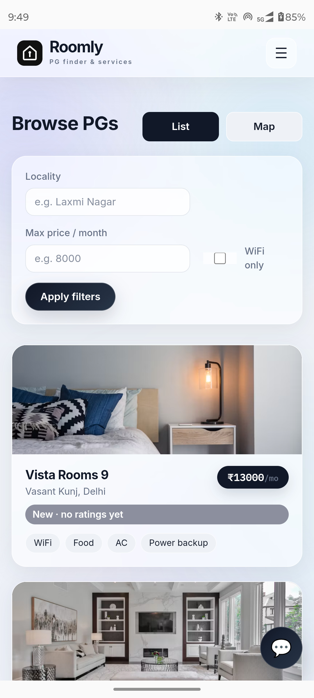 | 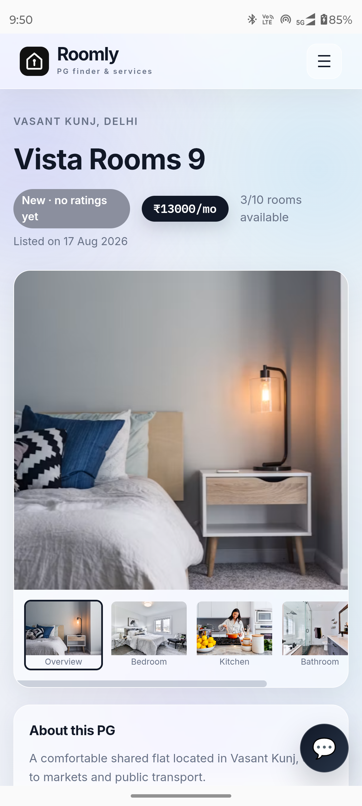 | 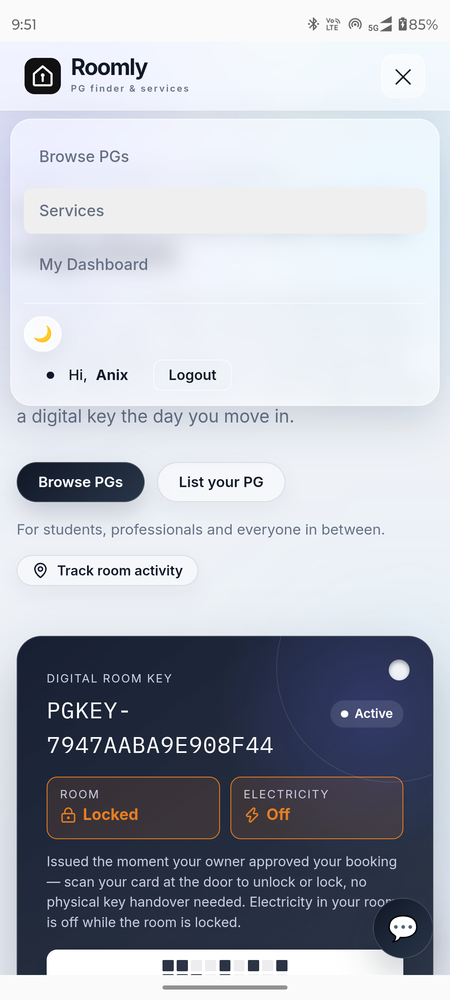 | 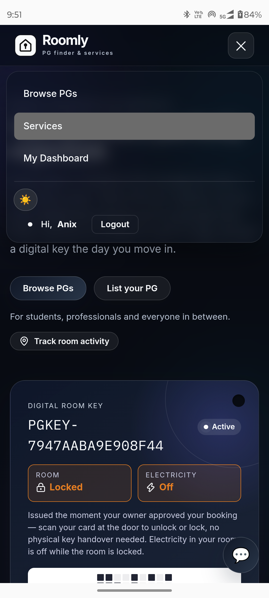 |

</div>

---

## 🚀 Features

### 👤 For residents
| Feature | What it does |
|---|---|
| 🔎 **Smart search** | Filter PGs by locality, maximum monthly price and WiFi availability |
| 🗺️ **List & Map views** | Browse as cards, or see every PG plotted on an interactive map (Leaflet + OpenStreetMap, no API key needed) |
| ⭐ **5-criteria ratings** | Cleanliness, WiFi, price-for-value, safety and owner behaviour, averaged into one overall score per PG |
| 📝 **Verified reviews** | Residents rate and review a PG; the full breakdown is shown on its detail page |
| 📩 **Booking requests** | Request a room and track the status: pending, approved or rejected |
| 🔑 **Digital room key** | The moment an owner approves a booking, a unique key (`PGKEY-…`) and a **QR code** are generated to show at the gate |
| 🤖 **AI chat assistant** | A Gemini-powered chatbot, available on every page, helps with PG search questions |

### 🏢 For PG owners
| Feature | What it does |
|---|---|
| ➕ **List your PG** | Address, locality/city, price, rooms, gender policy and utilities (WiFi, food, laundry, AC, parking, power backup) |
| 📍 **Pin the exact location** | Click on the map to place your PG precisely |
| ✅ **Request dashboard** | Approve or reject booking requests in one click |
| ✏️ **Manage listings** | Edit or delete your PGs at any time |

### 🎨 Design & experience
- Modern **glassmorphism** interface with smooth, subtle motion
- **Light and dark themes**, switchable from the navbar
- Fully **responsive**, with a hamburger menu on phones
- **Services** panel showing everything Roomly offers and how a stay can be customised

### 🧪 Room experience (interactive front-end prototype)
These screens are built and working in the UI. Their data is not yet stored on the server (see the [roadmap](#-roadmap)):

- **Door control demo** – lock/unlock the room, with a live activity log and room status
- **Electricity included** – no separate electricity bills; power is on while the room is unlocked and off while it is locked
- **Customise your stay** – choose AC or cooler, laundry and kitchen add-ons with live pricing
- **Personal kitchen** – included for rooms above ₹10,000, with premium appliances as paid monthly extras
- **Guest stay requests** – up to 2 nights per guest, priced from the room rent
- **Cleaning slots** – schedule a cleaning or choose self-cleaning
- **Security-deposit terms** – one month's base rent, clearly explained
- Pricing rules live in one file: `frontend/src/components/pricing.js`

---

## 🧱 Tech stack

| Layer | Technology |
|---|---|
| **Frontend** | React 18, Vite, React Router, Axios, Leaflet / react-leaflet, lucide-react |
| **Backend** | Node.js, Express, JWT authentication, bcrypt password hashing, `qrcode` |
| **Database** | SQLite via Node's built-in `node:sqlite` (zero native dependencies) |
| **AI** | Google Gemini (`@google/genai`) |
| **Mobile** | Capacitor (Android) |
| **Hosting** | Frontend on Vercel |

> **Requires Node.js 22.5 or newer** (for `node:sqlite`). Check with `node -v`.

---

## 🏗️ Architecture

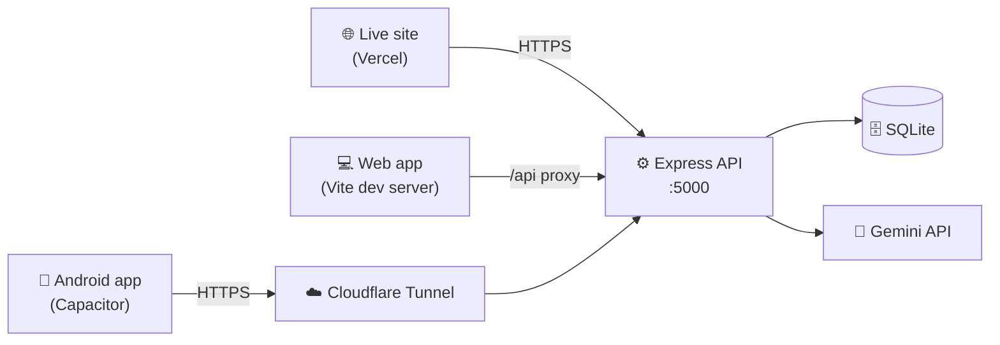

---

## 📁 Project structure

```
pg-management-system/
├── backend/                 Express API + SQLite
│   ├── routes/              auth, pgs, ratings, bookings, chatbot
│   ├── middleware/          JWT auth + role guards
│   ├── db.js                Database setup (tables + migrations)
│   ├── utils/key.js         Digital key + QR generation
│   ├── seed.js / reset.js   Demo data helpers
│   └── server.js
└── frontend/                React app (Vite)
    ├── src/
    │   ├── pages/           Home, Browse, PGDetails, dashboards, DigitalKey…
    │   ├── components/      Navbar, MapView, ChatWidget, PGCard…
    │   └── context/         Auth + Theme providers
    └── android/             Capacitor Android project
```

---

## ⚡ Getting started (run locally)

Just want to look around? Skip setup and open the **[live demo](https://pg-management-system-flax.vercel.app)**.

To run Roomly on your own machine:

### 1. Backend

```bash
cd backend
npm install
npm run dev
```

The API runs on `http://localhost:5000`. The SQLite file `data/pgms.db` is created automatically on first run.

**Optional: enable the AI assistant.** Create `backend/.env`:

```env
GEMINI_API_KEY=your_key_here
```

### 2. Frontend

In a second terminal:

```bash
cd frontend
npm install
npm run dev
```

Open `http://localhost:5173`. Vite proxies `/api` calls to the backend.

### 3. Try it out

1. Register as a **PG Owner** and list a PG.
2. In another browser (or an incognito tab), register as a **Resident**.
3. Browse, request a booking, and approve it from the owner dashboard.
4. Open the resident dashboard to see the **digital key and QR code**.

---

## 📱 Run it as an Android app

The web app is wrapped with [Capacitor](https://capacitorjs.com). You need [Android Studio](https://developer.android.com/studio) and a phone with USB debugging enabled.

The phone cannot reach `localhost`, so the backend must be exposed over HTTPS. A free [Cloudflare quick tunnel](https://developers.cloudflare.com/cloudflare-one/connections/connect-networks/do-more-with-tunnels/trycloudflare/) works well for development:

```bash
# Terminal 1: backend
cd backend && npm run dev

# Terminal 2: tunnel (prints a https://….trycloudflare.com link)
cloudflared tunnel --url http://localhost:5000
```

Create `frontend/.env` with the tunnel link (no trailing slash):

```env
VITE_API_URL=https://your-tunnel-name.trycloudflare.com
```

Build and open the Android project:

```bash
cd frontend
npm run build
npx cap sync
npx cap open android      # then press Run ▶ in Android Studio
```

> The quick-tunnel link changes every time the tunnel restarts. Update `frontend/.env`, then run `npm run build`, `npx cap sync` and Run again.

---

## ☁️ Deployment

The frontend is deployed on **Vercel** at [pg-management-system-flax.vercel.app](https://pg-management-system-flax.vercel.app). Pushing to `main` redeploys it automatically.

Set `VITE_API_URL` in the Vercel project settings (Settings → Environment Variables) to the public HTTPS address of your backend, then redeploy.

---

## 🔌 API overview

| Area | Endpoints |
|---|---|
| **Auth** | `POST /api/auth/register` · `POST /api/auth/login` · `GET /api/auth/me` |
| **PGs** | `GET /api/pgs` · `GET /api/pgs/:id` · `POST /api/pgs` · `PUT /api/pgs/:id` · `DELETE /api/pgs/:id` · `GET /api/pgs/owner/mine` |
| **Ratings** | `GET /api/ratings/pg/:pgId` · `POST /api/ratings` |
| **Bookings** | `POST /api/bookings` · `GET /api/bookings/student/mine` · `GET /api/bookings/owner/mine` · `PUT /api/bookings/:id/status` · `GET /api/bookings/:id/key` |
| **Chatbot** | `POST /api/chatbot` |

Protected routes use a JWT `Bearer` token and are restricted by role (`student` / `owner`).

---

## 🗺️ Roadmap

- [x] Deploy the frontend to Vercel
- [ ] Persist door lock state, guest requests, cleaning slots and complaints on the server
- [ ] **Kitchen Partner** accounts (sign-up option exists in the UI; backend support pending)
- [ ] Image upload for PG photos (currently an image URL)
- [ ] Allow ratings only from residents with an approved booking at that PG
- [ ] Pagination for listings and reviews
- [ ] Push notifications for booking updates
- [ ] Move the JWT secret to `.env` and deploy the backend to a permanent host

---

## 🔐 Notes

- Never commit `backend/.env` or the `data/*.db` files; both are already git-ignored.
- Switching to Google Maps is possible: replace the Leaflet components in `MapView.jsx` and `LocationPicker.jsx` with `@react-google-maps/api`. Everything else stays the same.

---

<div align="center">

**Roomly** · Your own room, perfectly organized.

</div>
